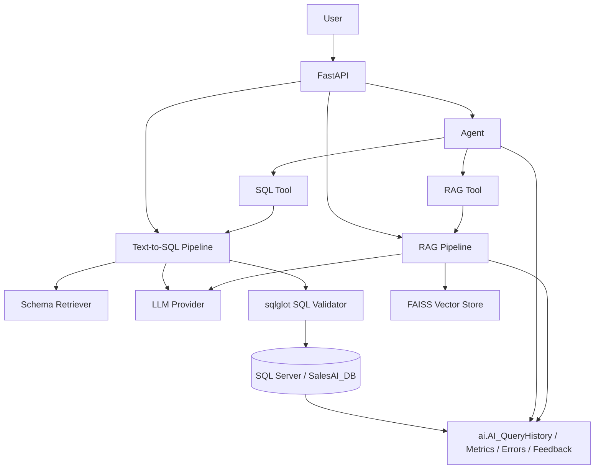

# Enterprise AI Data Copilot

An AI assistant that lets users query enterprise data (SQL Server) and internal documents in natural language, with deterministic safety controls around every model-generated action.

**Live API**: https://enterprise-ai-copilot-api.orangesky-0c279ec4.centralindia.azurecontainerapps.io (Azure Container Apps, free consumption tier, backed by a free-tier serverless Azure SQL Database in Central India). Note: the serverless database auto-pauses after ~60 minutes idle — the first request after a pause takes 30-60s to resume.

**Live UI**: https://enterprise-ai-data-copilot-tgcpcmtgj4crhyndhaeugu.streamlit.app/ (Streamlit Community Cloud, talks to the Azure-hosted API above)

Three capabilities, one architecture:
- **Text-to-SQL** — natural language → validated, read-only SQL → real query results → explanation
- **Enterprise RAG** — natural language → retrieved document evidence → grounded answer with citations
- **Agentic AI** — a planner decides which of the above tools (or both) a question needs

## Problem Statement

Enterprise data lives in SQL Server; policy and process knowledge lives in documents. Business users can't write SQL, and LLMs can't be trusted to execute arbitrary generated SQL against production data or to answer from documents without grounding. This project demonstrates a production-oriented pattern for closing that gap safely: **the LLM only suggests; deterministic code validates and executes.**

## Architecture



Key principle enforced throughout: **LLM output is never executed directly.** Every SQL suggestion passes through a deterministic `sqlglot`-based validator before touching the database.

## Technology Stack

| Layer | Choice | Why |
|---|---|---|
| API | FastAPI + Pydantic | Async, typed, auto-generated OpenAPI docs |
| Database | SQL Server (SQLAlchemy + pyodbc) | Real enterprise data, connection pooling, dynamic schema inspection |
| SQL validation | `sqlglot` (AST-based) | Real dialect-aware parsing, not regex string matching |
| Embeddings | Deterministic local hashed embeddings | Works offline, no model download, swappable later |
| Vector store | FAISS (`IndexFlatIP`) | Fast, swappable behind a thin interface |
| LLM | Provider-abstracted (`LLMProvider`) | Mock provider by default (no API key needed); OpenAI-compatible adapter when `LLM_API_KEY` is set |
| UI | Streamlit | Talks only to the FastAPI backend, no business logic in the UI |
| Tests | pytest (unit / integration / api / evaluation) | 69+ tests, all passing against the real database |

## Setup

```powershell
cd enterprise-ai-data-copilot
python -m venv .venv
.venv\Scripts\Activate.ps1
pip install -r requirements.txt
copy .env.example .env
```

Edit `.env` (see [Environment Variables](#environment-variables) below), then:

```powershell
uvicorn app.main:app --reload
```

In a second terminal, run the UI:

```powershell
streamlit run frontend/streamlit_app.py
```

## Environment Variables

See [.env.example](.env.example). Key ones:

| Variable | Purpose |
|---|---|
| `SQL_SERVER`, `SQL_DATABASE` | SQL Server host/instance and database name |
| `SQL_TRUSTED_CONNECTION` | `true` for Windows Auth (default, local dev), `false` to use `SQL_USERNAME`/`SQL_PASSWORD` |
| `LLM_API_KEY` | Optional. If unset, the app uses a deterministic mock LLM provider (no external calls, no cost) |
| `SQL_QUERY_TIMEOUT`, `MAX_RESULT_ROWS` | Bound every generated query's execution time and result size |
| `SCHEMA_CACHE_TTL_SECONDS` | How long schema metadata is cached before re-inspection |
| `API_KEYS` | JSON map of API key → role (`admin`/`analyst`/`viewer`). Ships with dev-only defaults — override before any shared deployment |

## SQL Server Configuration

The app connects independently to your `SalesAI_DB` (or any SQL Server database) — it does not share state with any other project. Both **Windows Authentication** (default, recommended for local dev) and **SQL Server Authentication** are supported via config alone; see [docs/deployment.md](docs/deployment.md) for how this changes for containerized/cloud deployment.

## API Examples

Every route except `GET /health` requires an `X-API-Key` header (see [Authentication & Roles](#authentication--roles)):

```bash
curl -X POST http://localhost:8000/sql/query -H "Content-Type: application/json" -H "X-API-Key: dev-viewer-key" \
  -d '{"question": "What is the total revenue?"}'

curl -X POST http://localhost:8000/rag/query -H "Content-Type: application/json" -H "X-API-Key: dev-viewer-key" \
  -d '{"question": "What is the refund policy for damaged products?"}'

curl -X POST http://localhost:8000/agent/query -H "Content-Type: application/json" -H "X-API-Key: dev-viewer-key" \
  -d '{"question": "Why did revenue decrease and what is the refund policy?"}'
```

Full interactive docs at `http://localhost:8000/docs` (FastAPI auto-generated OpenAPI).

## Authentication & Roles

See [docs/security.md](docs/security.md#role-based-access-control-appcoresecuritypy) for the full permission matrix. Summary:

| Role | Access |
|---|---|
| `viewer` | Curated Q&A only: `/sql/query`, `/rag/query`, `/agent/query`, `/feedback` |
| `analyst` | + raw SQL tools (`/sql/generate`, `/sql/execute`), `/schema`, `/health/database` |
| `admin` | + data management (`/schema/refresh`, `/rag/ingest`) |

Dev keys (`dev-admin-key`/`dev-analyst-key`/`dev-viewer-key`) are in `.env.example` for local testing only.

## Evaluation Methodology

See [docs/evaluation.md](docs/evaluation.md). Summary: 38 Text-to-SQL cases across basic/intermediate/advanced/business/negative categories, scored on **semantic correctness** (expected tables/keywords present in generated SQL, minimum row counts) — never exact-SQL-string matching. Plus 13 security cases (mutation SQL, injection, system-schema access, prompt injection). Current results: **38/38 (100%)** functional, **13/13 (100%)** security.

## Security

See [docs/security.md](docs/security.md). Core principles: LLM output is untrusted input (every generated SQL string is parsed with `sqlglot` and must be a single `SELECT`/`WITH` statement referencing no system schemas or dangerous functions before it ever reaches the database), and every route is role-gated via `X-API-Key` — see [Authentication & Roles](#authentication--roles).

## Observability

Every Text-to-SQL request is recorded in `ai.AI_QueryHistory` with per-stage latency in `ai.AI_QueryExecutionMetrics`; failures land in `ai.AI_QueryErrors`; user feedback is captured via `POST /feedback` into `ai.AI_QueryFeedback`. Observability writes never break the request path — if the `ai.*` tables are unavailable, a warning is logged and the request still succeeds.

## Deployment

See [docs/deployment.md](docs/deployment.md). Dockerfile is verified to build and run (non-root user, healthcheck). `docker-compose.yml` provides local `api` + `streamlit` services. Deployment is cloud-agnostic — see the interview guide for Azure/Kubernetes/AMD GPU discussion.

## Limitations

- The default LLM provider is a **deterministic mock** covering ~20 known business question patterns (including window functions, running totals, percentage share, and cohort analysis) — sufficient to demonstrate the full pipeline and pass evaluation without incurring API costs, but not a general-purpose NLP-to-SQL model. Set `LLM_API_KEY` to use a real OpenAI-compatible model for arbitrary questions.
- The keyword-overlap schema retriever uses a business-term synonym map (e.g. "revenue" → `TotalAmount`, "region" → `ShippingState`) to reduce mismatches, but it's still deterministic keyword matching, not semantic retrieval — an unmapped synonym can still miss a table.
- Hosted CI does not run integration/evaluation tests because they require a live SQL Server connection; see [docs/deployment.md](docs/deployment.md) for CI-with-database options.
- Windows Authentication only works when the app runs on Windows with domain/SSPI access; containerized deployments must use SQL Server Authentication.

## Future Improvements

- Real embedding model (e.g. `sentence-transformers`) behind the existing `EMBEDDING_MODEL` config flag
- Expand the mock LLM provider or wire a local inference server (see [docs/deployment.md](docs/deployment.md) AMD GPU section)
- CI service container running a seeded SQL Server for full integration test coverage
- Semantic (embedding-based) schema retrieval to replace keyword overlap + synonym map, for full coverage of unmapped business vocabulary

## Documentation

- [docs/architecture.md](docs/architecture.md)
- [docs/text-to-sql.md](docs/text-to-sql.md)
- [docs/rag.md](docs/rag.md)
- [docs/agents.md](docs/agents.md)
- [docs/security.md](docs/security.md)
- [docs/evaluation.md](docs/evaluation.md)
- [docs/deployment.md](docs/deployment.md)
- [docs/troubleshooting.md](docs/troubleshooting.md)
- [docs/interview-guide.md](docs/interview-guide.md)
